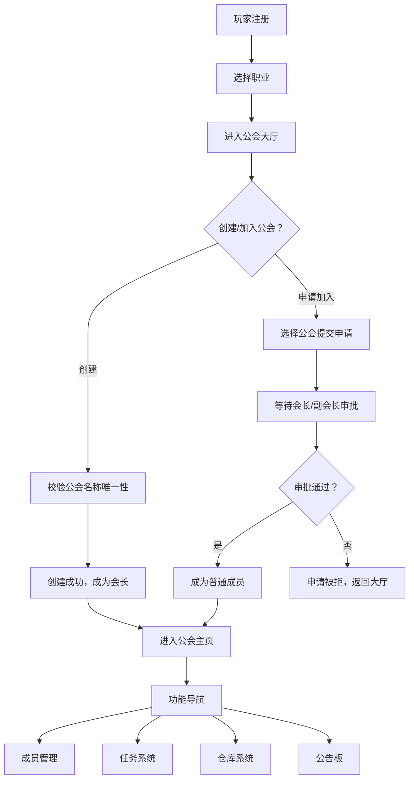

## 1. 产品概述
游戏公会管理系统，为玩家提供完整的公会运营解决方案，支持公会创建、成员管理、任务系统、仓库管理和公告发布。
- 面向游戏玩家群体，解决公会日常运营中的协作、权限、资源分配等问题
- 提升公会管理效率，增强成员互动体验，建立清晰的等级和贡献体系

## 2. 核心特性

### 2.1 用户角色
| 角色 | 注册方式 | 核心权限 |
|------|----------|----------|
| 玩家（无公会） | 用户名注册 | 选择职业、创建公会、申请加入公会、浏览公会列表 |
| 普通成员 | 申请加入 | 接取任务、贡献物品、申请物品、查看公告、查看成员 |
| 副会长 | 会长任命 | 审批成员申请、审批物品申请、发布任务、管理仓库 |
| 会长 | 创建公会 | 所有副会长权限 + 任命/罢免副会长、踢出成员、发布公告、解散公会 |

### 2.2 功能模块
1. **登录注册页**：玩家注册、登录、职业选择
2. **公会大厅**：公会列表、创建公会、申请加入
3. **公会主页**：公会信息、成员列表、公告板、快速入口
4. **成员管理**：成员列表、待审批列表、角色管理、踢出成员
5. **任务系统**：任务列表、发布任务、接取任务、完成任务、每日结算
6. **仓库系统**：物品列表、贡献物品、申请物品、审批物品申请
7. **公告板**：发布公告、查看公告

### 2.3 页面详情
| 页面名称 | 模块名称 | 功能描述 |
|---------|---------|----------|
| 登录注册页 | 注册表单 | 用户名、密码、职业选择、数据校验 |
| 登录注册页 | 登录表单 | 用户名、密码登录、错误提示 |
| 公会大厅 | 公会列表 | 展示所有公会、公会信息、申请按钮 |
| 公会大厅 | 创建公会 | 公会名称、公告、创建校验（名称唯一性、资金要求） |
| 公会主页 | 公会信息 | 公会名称、等级、人数、资金、会长信息 |
| 公会主页 | 公告板 | 最新公告展示、滚动动画 |
| 公会主页 | 快捷入口 | 成员管理、任务、仓库、公告入口 |
| 成员管理页 | 成员列表 | 角色标签、贡献排名、操作按钮 |
| 成员管理页 | 待审批列表 | 申请信息、批准/拒绝按钮 |
| 任务系统页 | 任务列表 | 进行中/已完成分类、任务详情、倒计时 |
| 任务系统页 | 任务发布 | 任务名称、描述、奖励、时限、发布校验 |
| 任务系统页 | 任务接取 | 接取确认、状态更新、时限倒计时 |
| 仓库系统页 | 物品列表 | 物品分类、数量、贡献者信息 |
| 仓库系统页 | 物品贡献 | 物品名称、数量、提交校验 |
| 仓库系统页 | 物品申请 | 申请列表、审批操作 |
| 公告板页 | 公告列表 | 时间线展示、发布表单（仅会长） |

## 3. 核心流程
玩家注册账号并选择职业 → 浏览公会大厅 → 创建或申请加入公会 → 进入公会主页 → 根据角色权限参与任务、仓库、公告等功能

## 4. 界面设计

### 4.1 设计风格
- 主色调：深紫色（#6366f1）作为主色，金色（#f59e0b）作为强调色，配合深色背景
- 按钮风格：圆角卡片式按钮，悬停时有光晕效果和轻微上浮动画
- 字体：标题使用 Cinzel（古典游戏风格），正文使用 Noto Sans SC（清晰易读）
- 布局：侧边导航 + 主内容区的卡片式布局，带玻璃拟态效果
- 图标风格：使用 lucide-react 图标，配合游戏风格的徽章和装饰元素

### 4.2 页面设计概览
| 页面名称 | 模块名称 | UI元素 |
|---------|---------|--------|
| 登录注册页 | 表单区 | 深色渐变背景、发光输入框、职业卡片选择、动画过渡 |
| 公会大厅 | 公会列表 | 网格布局、公会卡片、悬停放大效果、申请按钮组 |
| 公会主页 | 信息区 | 大标题公会名称、金色边框装饰、成员人数统计、贡献积分展示 |
| 公会主页 | 快捷入口 | 四个功能卡片、图标+文字、点击波纹效果 |
| 成员管理页 | 成员列表 | 表格布局、角色徽章（金/银/铜）、操作按钮组 |
| 任务系统页 | 任务卡片 | 进度条、倒计时计时器、任务状态标签 |
| 仓库系统页 | 物品网格 | 物品图标、数量角标、稀有度颜色边框 |
| 公告板页 | 时间线 | 左侧时间轴、右侧公告内容、新公告标记 |

### 4.3 响应式
- 桌面端优先设计，主内容区最小宽度 1200px
- 平板端：侧边栏收起为图标导航，内容区自适应
- 移动端：底部标签导航，卡片垂直堆叠，优化触摸区域

### 4.4 动效设计
- 页面加载：元素从下至上淡入，依次延迟 50ms 呈现
- 按钮交互：悬停时背景色渐变 + 轻微上浮 2px + 阴影加深
- 卡片交互：悬停时缩放 1.02 + 光晕效果
- 状态变化：成功操作绿色闪光提示，错误操作红色抖动效果
- 数据更新：新消息/新任务从右侧滑入，带轻微弹跳
