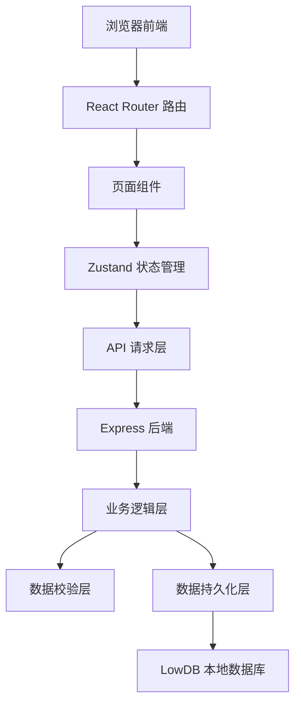
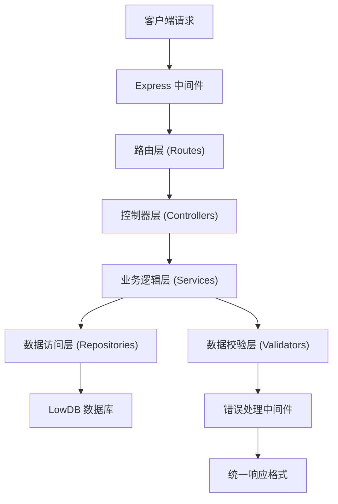
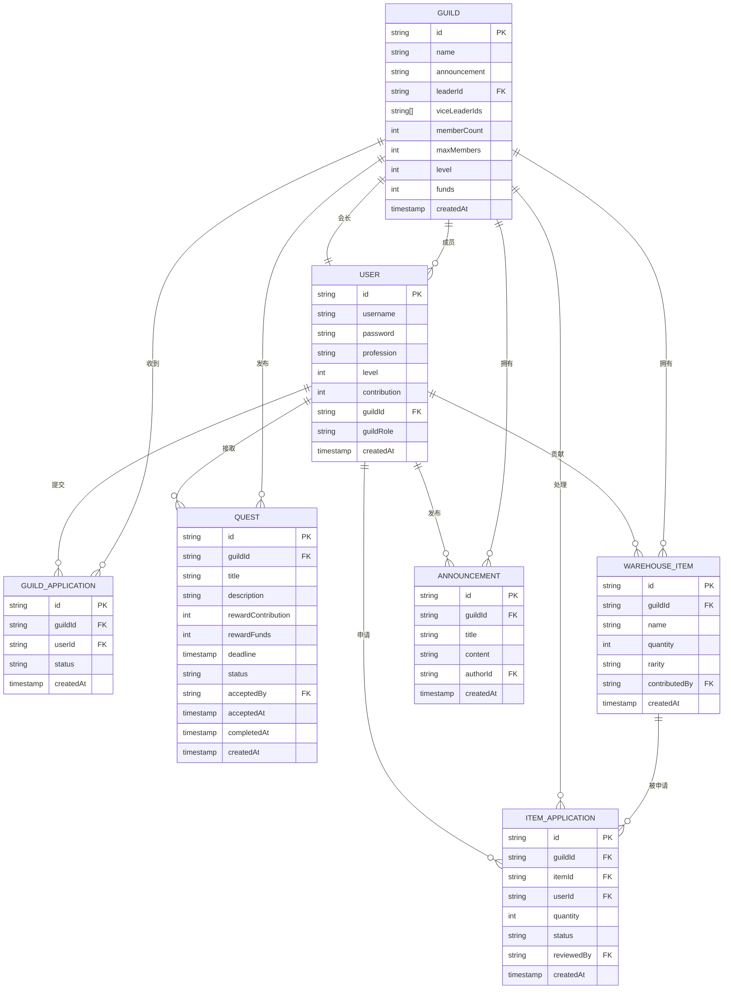

## 1. 架构设计



## 2. 技术说明
- 前端：React@18 + TypeScript + tailwindcss@3 + Vite
- 初始化工具：vite-init
- 后端：Express@4 + TypeScript
- 数据库：LowDB（本地 JSON 数据库，便于演示）
- 状态管理：Zustand
- 路由：React Router DOM
- 图标：lucide-react

## 3. 路由定义
| 路由 | 用途 |
|------|------|
| /login | 登录页面 |
| /register | 注册页面 |
| /hall | 公会大厅（公会列表） |
| /guild/:id | 公会主页 |
| /guild/:id/members | 成员管理 |
| /guild/:id/quests | 任务系统 |
| /guild/:id/warehouse | 仓库系统 |
| /guild/:id/announcements | 公告板 |

## 4. API 定义

```typescript
// 用户相关
interface User {
  id: string;
  username: string;
  password: string;
  profession: 'warrior' | 'mage' | 'archer' | 'priest';
  level: number;
  contribution: number;
  guildId: string | null;
  guildRole: 'leader' | 'vice_leader' | 'member' | null;
  createdAt: number;
}

// 公会相关
interface Guild {
  id: string;
  name: string;
  announcement: string;
  leaderId: string;
  viceLeaderIds: string[];
  memberCount: number;
  maxMembers: number;
  level: number;
  funds: number;
  createdAt: number;
}

// 成员申请
interface GuildApplication {
  id: string;
  guildId: string;
  userId: string;
  status: 'pending' | 'approved' | 'rejected';
  createdAt: number;
}

// 任务相关
interface Quest {
  id: string;
  guildId: string;
  title: string;
  description: string;
  reward: {
    contribution: number;
    funds: number;
  };
  deadline: number;
  status: 'available' | 'in_progress' | 'completed' | 'expired';
  acceptedBy: string | null;
  acceptedAt: number | null;
  completedAt: number | null;
  createdAt: number;
}

// 仓库物品
interface WarehouseItem {
  id: string;
  guildId: string;
  name: string;
  quantity: number;
  rarity: 'common' | 'uncommon' | 'rare' | 'epic' | 'legendary';
  contributedBy: string;
  createdAt: number;
}

// 物品申请
interface ItemApplication {
  id: string;
  guildId: string;
  itemId: string;
  userId: string;
  quantity: number;
  status: 'pending' | 'approved' | 'rejected';
  reviewedBy: string | null;
  createdAt: number;
}

// 公告
interface Announcement {
  id: string;
  guildId: string;
  title: string;
  content: string;
  authorId: string;
  createdAt: number;
}

// API 响应格式
interface ApiResponse<T> {
  success: boolean;
  data?: T;
  error?: string;
}
```

## 5. 服务器架构图



## 6. 数据模型

### 6.1 数据模型定义



### 6.2 初始化数据
- 3 个示例公会：「星辰骑士团」「暗影议会」「光明圣殿」
- 6 个示例玩家账号（不同职业）
- 若干示例任务、物品、公告
- 演示用的成员申请和物品申请记录
